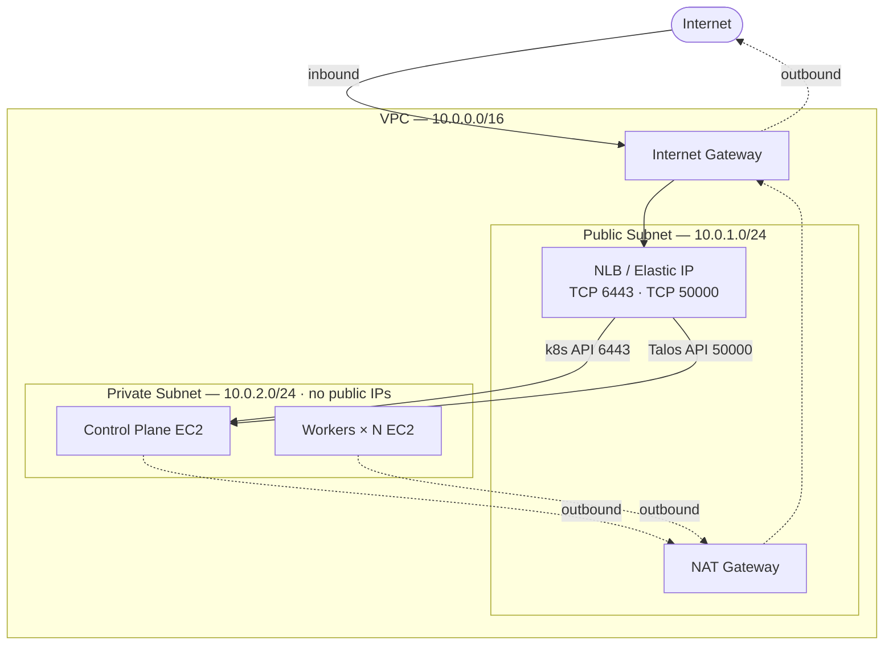
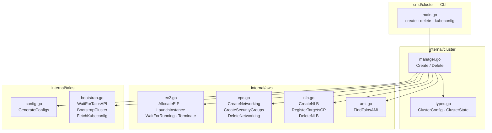
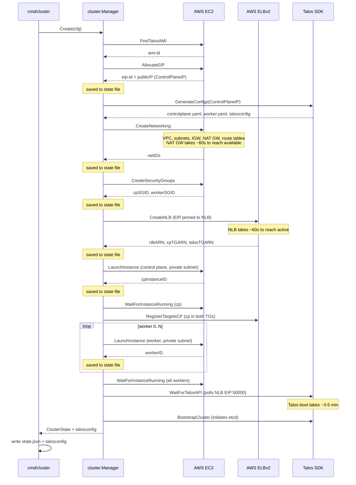
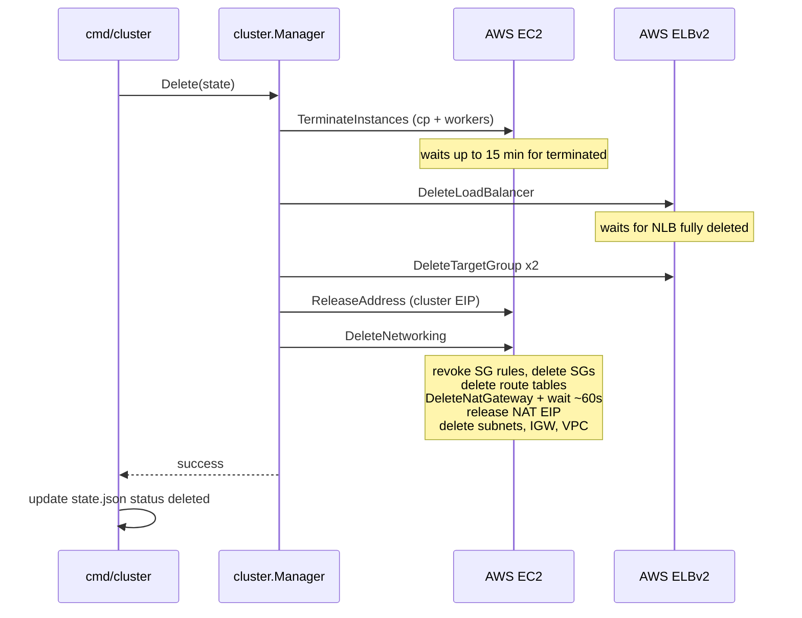

# Architecture

## AWS Infrastructure

Each cluster is provisioned inside a dedicated VPC with a two-tier network: a public subnet for internet-facing infrastructure (NLB, NAT Gateway) and a private subnet for EC2 instances. No instance has a public IP address.



Solid arrows = inbound path (Internet → NLB → Control Plane).
Dashed arrows = outbound path (instances → NAT Gateway → internet).

**Key design decisions:**

- The cluster's Elastic IP is pinned to the NLB at creation time. It is baked into the Talos machine configs as the Kubernetes API endpoint before any instances are launched.
- Security groups allow TCP 6443 and TCP 50000 only from the VPC CIDR (`10.0.0.0/16`). NLB health checks originate from within the VPC, so this is sufficient.
- The NAT Gateway gives private instances outbound internet access (container image pulls, time sync, etc.) without exposing any inbound surface.
- Each cluster gets its own VPC, so clusters are fully isolated from each other.

---

## Code Structure



---

## Create Sequence



---

## Delete Sequence



---

## State File

The `create` command writes a JSON state file after every significant resource allocation. This file is the input to `delete`. If `create` is interrupted mid-run, the partial state file is still valid — pass it to `delete` to clean up whatever was provisioned.

```
{
  config: {
    // generated on create
    cluster_id,               // 10-char random hex — unique per cluster instance

    // user-supplied
    name, region, talos_version, kube_version,
    control_plane_type, worker_type, worker_count, ami_id,

    // networking
    vpc_id, public_subnet_id, subnet_id (private),
    igw_id, route_table_id (public), private_route_table_id,
    nat_gateway_id, nat_gateway_eip_id,
    control_plane_sg_id, worker_sg_id,

    // load balancer
    eip_id, control_plane_ip,
    nlb_arn, cp_target_group_arn, talos_target_group_arn,

    // instances
    control_plane_id, worker_ids[]
  },
  status: "creating" | "running" | "deleting" | "deleted"
}
```
